# Kifayti WebApp - Comprehensive Project Summary

**Project Name:** Kifayti WebApp  
**Version:** 0.1.0  
**Type:** React-based Healthcare Management Web Application  
**Current Date:** January 31, 2026

---

## Table of Contents

1. [Project Overview](#project-overview)
2. [Technology Stack](#technology-stack)
3. [Project Architecture](#project-architecture)
4. [Directory Structure](#directory-structure)
5. [Core Features](#core-features)
6. [API Integration](#api-integration)
7. [Components & Pages](#components--pages)
8. [State Management](#state-management)
9. [Deployment & DevOps](#deployment--devops)
10. [Data Flow Diagrams](#data-flow-diagrams)
11. [Module Dependencies](#module-dependencies)

---

## Project Overview

**Kifayti WebApp** is a comprehensive healthcare management application built with React. The application is designed to manage patient health records, doctor communications, lab reports, daily readings, and various administrative functions.

### Key Objectives:
- Manage patient health data and medical records
- Facilitate doctor-patient communication through chat
- Handle dialysis and daily readings tracking
- Generate and manage medical reports
- Support role-based access control (Admin, Doctor, Patient)
- Provide AI-powered chat capabilities for health guidance
- Track medical alerts and alarms
- Manage medication prescriptions and dietary details

### Target Users:
- **Patients:** Monitor health readings, view prescriptions, communicate with doctors
- **Doctors:** View patient dashboards, manage medical records, communicate with patients
- **Administrators:** Manage users, roles, parameters, and system configurations

---

## Technology Stack

### Frontend Framework & Libraries

```json
{
  "Core": {
    "React": "^18.3.1",
    "React DOM": "^18.2.0",
    "React Router": "^6.21.2"
  },
  "State Management": {
    "Redux Toolkit": "^2.2.1",
    "React Redux": "^9.1.0"
  },
  "UI & Styling": {
    "Material-UI": "^5.15.5",
    "@emotion/react": "^11.11.3",
    "@emotion/styled": "^11.11.0",
    "Tailwind CSS": "^3.4.1",
    "Reactstrap": "^9.2.2"
  },
  "Data Visualization": {
    "Recharts": "^2.10.4",
    "React Icons": "^5.0.1"
  },
  "PDF Handling": {
    "@react-pdf-viewer/core": "^3.12.0",
    "@react-pdf-viewer/default-layout": "^3.12.0",
    "@react-pdf/renderer": "^3.4.4",
    "jspdf": "^2.5.1",
    "pdf-lib": "^1.17.1",
    "react-pdf": "^7.7.3"
  },
  "Data Handling": {
    "axios": "^1.11.0",
    "react-papaparse": "^4.4.0",
    "date-fns": "^3.6.0"
  },
  "Real-time Communication": {
    "socket.io-client": "^4.7.4"
  },
  "Chat & Communication": {
    "deep-chat-react": "^1.4.11"
  },
  "UI Components": {
    "react-modal": "^3.16.1",
    "react-loading": "^2.0.3",
    "react-select": "^5.8.0",
    "react-toastify": "^10.0.5",
    "react-data-table-component": "^7.6.2",
    "react-collapsible": "^2.10.0",
    "react-paginate": "^8.2.0",
    "react-date-range": "^2.0.1",
    "react-webcam": "^7.2.0"
  },
  "Other Utilities": {
    "cors": "^2.8.5",
    "web-vitals": "^2.1.4"
  }
}
```

### Build Tools

```json
{
  "Build": "react-scripts 5.0.1",
  "CSS Processing": "sass ^1.69.7",
  "Webpack": "bundled with react-scripts",
  "Dev Server": "Built-in with react-scripts"
}
```

### Containerization

- **Docker:** Alpine Node.js 18 for build, Nginx Alpine for production
- **Base Image:** `node:18-alpine` (Build stage)
- **Production Image:** `nginx:alpine`

---

## Project Architecture

### High-Level Architecture Diagram

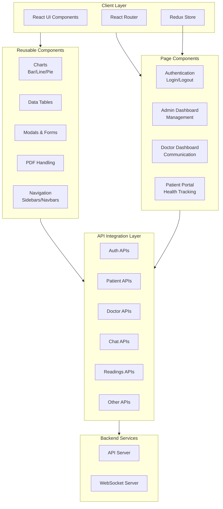

### Component Hierarchy

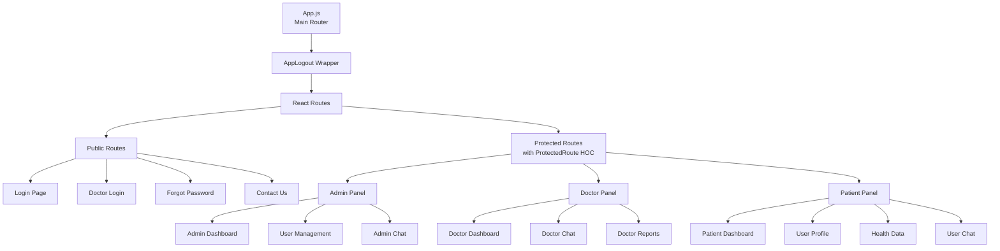

---

## Directory Structure

### Project Root Structure

```
kifayti-webapp1/
├── Dockerfile                 # Docker configuration for containerization
├── package.json              # Project dependencies and scripts
├── README.md                 # Default Create React App README
├── tailwind.config.js        # Tailwind CSS configuration
├── webpack.config.js         # Webpack configuration
├── build/                    # Production build output
│   ├── manifest.json
│   └── robots.txt
├── public/                   # Static public assets
│   ├── index.html
│   ├── manifest.json
│   ├── robots.txt
│   └── pdfjs-worker/        # PDF.js worker files
└── src/                      # Source code
```

### Source Code Structure

#### 📁 `/src` - Main Application Directory

```
src/
├── App.css                   # Main application styles
├── App.js                    # Root application component with routing
├── index.css                 # Global styles
├── index.js                  # React entry point
│
├── ApiCalls/                 # API integration layer
│   ├── adminDashApis.js
│   ├── ailmentApis.js
│   ├── alarmsApis.js
│   ├── alertsApis.js
│   ├── appAlerts.js
│   ├── authapis.js          # Authentication endpoints
│   ├── chatApis.js
│   ├── commentApi.js
│   ├── contactus.js
│   ├── dataUpload.js
│   ├── doctorAlert.js
│   ├── doctorApis.js
│   ├── GetComments.js
│   ├── languageApis.js
│   ├── manageparameters.js
│   ├── patientAPis.js
│   ├── prescriptionApis.js
│   ├── questionApis.js
│   ├── readingsApis.js
│   └── README.md
│
├── app/                      # Redux store configuration
│   └── store.js             # Redux store setup
│
├── assets/                   # Static assets
│   └── index.js
│
├── components/               # Reusable React components
│   ├── barChart/
│   │   └── BarChart.jsx
│   ├── barChartPercentageReturn/
│   │   └── BarChart.jsx
│   ├── buttons/
│   │   └── buttons.jsx
│   ├── csvlab/
│   │   └── CSVLab.jsx
│   ├── csvLab2/
│   │   └── CSVLab2.jsx
│   ├── csvProfile/
│   │   └── CSVProfile.jsx
│   ├── Dailycsv/
│   │   └── CSVLab.jsx
│   ├── doctorNavbar/
│   │   └── DoctorNavbar.jsx
│   ├── horizontalBarChartAdherance/
│   │   └── BarChart.jsx
│   ├── Linechart/            # Line chart with modals
│   │   ├── EnterReadingsModel.jsx
│   │   ├── linechart.css
│   │   ├── linechart.scss
│   │   ├── LineChartComponent.jsx
│   │   ├── UpdateRangeModel.jsx
│   │   └── utils.js
│   ├── linechartlab/
│   ├── linecomponent-sys-dys/
│   ├── logout/
│   │   └── Logout.jsx
│   ├── mixedBarChart/
│   ├── modals/               # Reusable modal components
│   ├── navbar/
│   │   └── Navbar.jsx
│   ├── pdf/                  # PDF handling components
│   ├── pdfExtractor/         # PDF extraction utilities
│   ├── pieChart/
│   │   └── PieChart.jsx
│   ├── questions/
│   ├── ReportModal/
│   ├── sidebar/
│   │   └── Sidebar.jsx
│   ├── sidebarDoctor/
│   │   └── SidebarDoctor.jsx
│   ├── simpleLineChart/
│   ├── table/                # Data table components
│   └── UserListAdmin/
│       ├── UserListManage.jsx
│       └── UserMedicalTeam.jsx
│
├── constants/                # Application constants
│   ├── constants.js
│   └── ReadingConstants.js
│
├── helpers/                  # Utility functions and helpers
│   ├── alertsSorting.js
│   ├── fileuploadHelper.js
│   ├── formatDate.js
│   ├── postToCloudinaryImage.js
│   ├── ProtectedRoute.jsx    # Route protection HOC
│   ├── utils.js
│   └── axios/               # Axios configuration
│
├── pages/                    # Full-page components (routes)
│   ├── adminchat/
│   │   └── AdminChat.jsx
│   ├── adminDashboard/
│   │   └── AdminDashboard.jsx
│   ├── adminManagement/
│   │   ├── AdminManagement.jsx
│   │   ├── AddRole.jsx
│   │   ├── EditRole.jsx
│   │   ├── UserRoles.jsx
│   │   └── DoctorManagement.jsx
│   ├── AIChat/
│   │   └── AiChat.jsx
│   ├── alimentMaster/
│   │   └── AlimentMaster.jsx
│   ├── AuditLogs/
│   │   ├── patientLog.jsx
│   │   ├── DoctorLog.jsx
│   │   └── Logs.jsx
│   ├── changePassword/
│   │   └── ChangePassword.jsx
│   ├── contactus/
│   │   ├── contactpage.jsx
│   │   └── singleContact.jsx
│   ├── dailyReadings/
│   │   ├── DailyReadings.jsx
│   │   └── DailyReadingCsv1.jsx
│   ├── dialysisReadings/
│   │   ├── DialysisReadings.jsx
│   │   └── DialysisReadingCsv.jsx
│   ├── doctorChat/
│   │   └── DoctorChat.jsx
│   ├── doctorDashboard/
│   │   └── DoctorDashboard.jsx
│   ├── doctorLogin/
│   │   └── DoctorLogin.jsx
│   ├── doctorReport/
│   │   └── DoctorReport.jsx
│   ├── forgotpassword/
│   │   └── ForgotPassword.jsx
│   ├── kfre/
│   │   ├── Kfre.jsx
│   │   └── KfreSingle.jsx
│   ├── labreports/
│   │   └── Labreports.jsx
│   ├── language/
│   │   └── LanguageMaster.jsx
│   ├── login/
│   │   └── Login.jsx
│   ├── ManageParameters/
│   │   └── ManageParameters.jsx
│   ├── patient/
│   │   ├── Patient.jsx
│   │   ├── AddPatientForm.jsx
│   │   ├── DeletePatient.jsx
│   │   └── delPatient.jsx
│   ├── profileQuestion/
│   │   ├── ProfileQuestions.jsx
│   │   └── ProfileQuestionCsv.jsx
│   ├── ShowAlarms/
│   │   └── ShowAlarms.jsx
│   ├── userprofile2/
│   │   └── UserProfile.jsx
│   ├── userProgramSelection/
│   │   ├── UserProgramSelection.jsx
│   │   └── UniqueUserProgramSelection.jsx
│   ├── UserDietDetails/
│   │   └── UserDietDetails.jsx
│   ├── UserLabReports/
│   │   └── UserLabReports.jsx
│   ├── Userprescription/
│   │   ├── Userprescription.jsx
│   │   └── UniqueUserprescription.jsx
│   └── UserRequisition/
│       └── UserRequisition.jsx
│
├── redux/                    # Redux state management
│   └── permissionSlice.js   # Permission-based access control
│
└── Styles/                   # Global stylesheet
    └── PatientList.css
```

---

## Core Features

### 1. **Authentication & Authorization**
- Patient login and registration
- Doctor login
- Admin authentication
- Forgot password functionality
- Change password capability
- Role-based access control (RBAC)
- Protected routes using `ProtectedRoute` HOC

### 2. **Patient Management**
- Patient registration and profile management
- Patient deletion and profile updates
- Patient health history tracking
- Patient list management by admin

### 3. **Health Data Management**
- **Daily Readings:** Track daily vital signs and measurements
- **Dialysis Readings:** Specialized readings for dialysis patients
- **Lab Reports:** Upload and manage lab test reports
- **KFRE Calculation:** Kidney Function Risk Equation for renal disease prediction
- **Alarms & Alerts:** Monitor critical health alerts

### 4. **Doctor-Patient Communication**
- Real-time chat between doctors and patients
- Admin chat functionality
- Message threading and history
- Socket.io integration for real-time updates

### 5. **Medical Data Visualization**
- **Line Charts:** Visualize health metrics over time (systolic/diastolic)
- **Bar Charts:** Compare data across categories
- **Pie Charts:** Show proportional data
- **Mixed Charts:** Combine multiple visualization types
- **Horizontal Bar Charts:** Display adherence metrics

### 6. **Report Generation**
- Doctor reports with medical insights
- PDF report generation and export
- CSV data export and import
- Lab report management
- Report modal views

### 7. **Administrative Functions**
- **User Management:** Create, edit, delete users
- **Role Management:** Define and assign user roles
- **Doctor Management:** Manage healthcare providers
- **Aliment Master:** Manage dietary information
- **Parameter Management:** Configure system parameters
- **Audit Logs:** Track system activities and user actions
- **Admin Dashboard:** Overview of system metrics

### 8. **Medical Information**
- **Prescriptions:** Manage medication prescriptions
- **Diet Details:** Track dietary recommendations
- **Medical Requisitions:** Handle medical requests
- **Questions Management:** Manage health assessment questions
- **Language Support:** Multi-language interface

### 9. **AI-Powered Features**
- AI Chat for health guidance
- Deep chat integration
- Natural language processing for health queries

### 10. **Additional Features**
- Contact us page
- File upload to Cloudinary
- CSV data handling and parsing
- Webcam integration for photo capture
- Date range selection
- Data pagination and sorting
- Modal-based forms

---

## API Integration

### API Calls Structure

The application uses Axios for HTTP requests and is organized into specialized API modules in the `ApiCalls` directory:

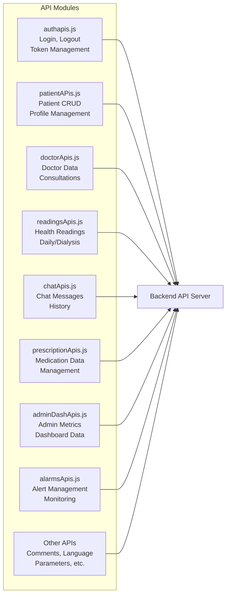

### API Endpoints Categories

| Module | Purpose | Key Functions |
|--------|---------|----------------|
| `authapis.js` | Authentication | Login, Logout, Token verification |
| `patientAPis.js` | Patient data | CRUD operations, profile management |
| `doctorApis.js` | Doctor operations | Doctor profile, consultations |
| `readingsApis.js` | Health readings | Daily/dialysis readings submission/retrieval |
| `chatApis.js` | Messaging | Send/receive messages, chat history |
| `prescriptionApis.js` | Prescriptions | Medication management |
| `adminDashApis.js` | Admin dashboard | System metrics and overview data |
| `alarmsApis.js` | Alerts/alarms | Critical alert management |
| `commentApi.js` | Comments | Medical notes and comments |
| `ailmentApis.js` | Ailment data | Disease/condition information |
| `alertsApis.js` | Alert management | System alerts |
| `dataUpload.js` | File upload | CSV and document upload |
| `languageApis.js` | Localization | Language preferences |
| `manageparameters.js` | System config | Parameter management |
| `contactus.js` | Contact info | Support requests |

---

## Components & Pages

### Chart Components

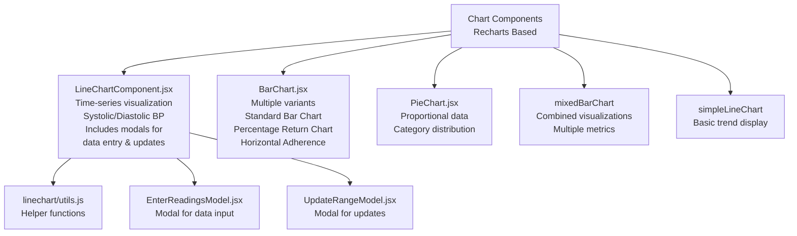

### Data Table Components

```
table/
├── Standard data table display
├── Sorting capabilities
├── Pagination support
├── Row selection
└── Column customization
```

### Navigation Components

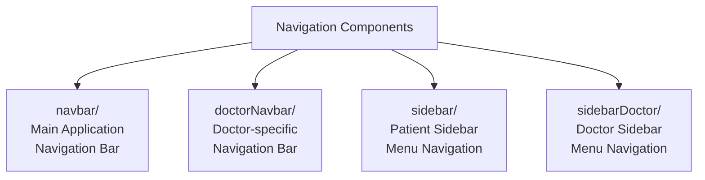

### Modal Components

```
modals/
├── Alert modals
├── Confirmation dialogs
├── Form modals
├── Data entry modals
└── Success/Error notification modals
```

### PDF Components

```
pdf/
└── PDF generation and viewing

pdfExtractor/
└── Extract data from PDF documents
```

### Page Structure by Role

#### **Admin Pages**
- Admin Dashboard - Overview and metrics
- User Management - Create/edit/delete users
- Role Management - Define user roles
- Doctor Management - Manage healthcare providers
- Aliment Master - Dietary information
- Parameter Management - System configuration
- Audit Logs - System activity tracking
- Admin Chat - Communication interface

#### **Doctor Pages**
- Doctor Dashboard - Patient overview
- Doctor Chat - Patient communication
- Doctor Reports - Medical reports
- Patient List - Manage assigned patients

#### **Patient Pages**
- Daily Readings - Track daily metrics
- Dialysis Readings - Dialysis-specific data
- Lab Reports - Medical test results
- Prescriptions - Medication information
- Diet Details - Dietary recommendations
- Health Alerts - Monitor critical alerts
- User Profile - Personal information
- AI Chat - Health guidance

---

## State Management

### Redux Architecture

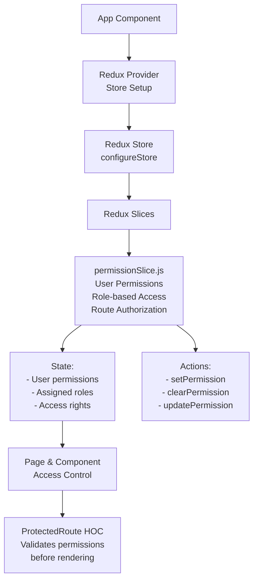

### State Flow Diagram

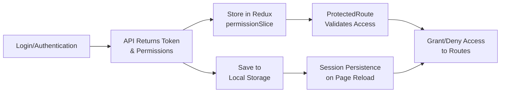

---

## Deployment & DevOps

### Docker Configuration

```dockerfile
# Build Stage
FROM node:18-alpine AS builder
WORKDIR /app
COPY package*.json ./
RUN npm install
COPY . .
ARG REACT_APP_API_SERVER_URL
ENV REACT_APP_API_SERVER_URL=$REACT_APP_API_SERVER_URL
RUN npm run build

# Production Stage
FROM nginx:alpine
COPY --from=builder /app/build /usr/share/nginx/html
EXPOSE 80
CMD ["nginx", "-g", "daemon off;"]
```

### Build Process

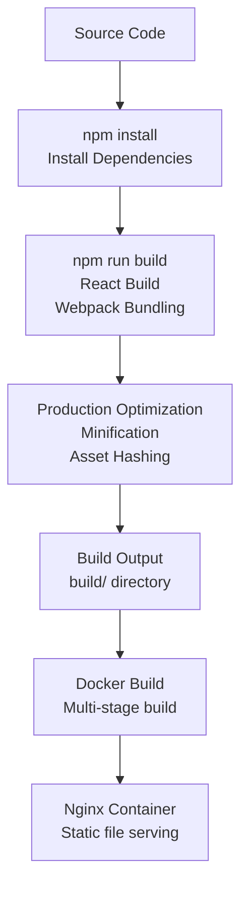

### Environment Configuration

```javascript
// Build-time configuration
REACT_APP_API_SERVER_URL // Backend API endpoint
// Can be set during Docker build with ARG
```

### Available npm Scripts

```bash
npm start      # Start development server on port 3000
npm run build  # Create production build
npm test       # Run tests
npm run eject  # Eject from Create React App (one-way operation)
```

---

## Data Flow Diagrams

### Authentication Flow

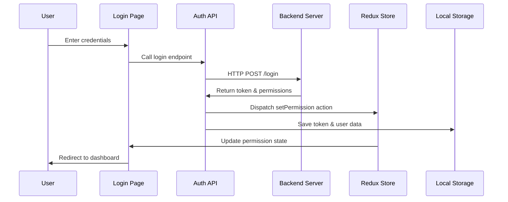

### Patient Health Data Submission Flow

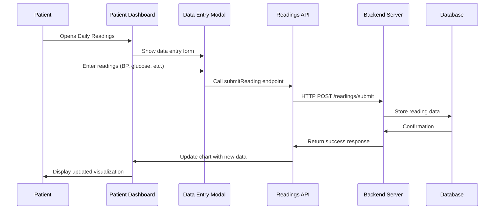

### Doctor-Patient Chat Flow

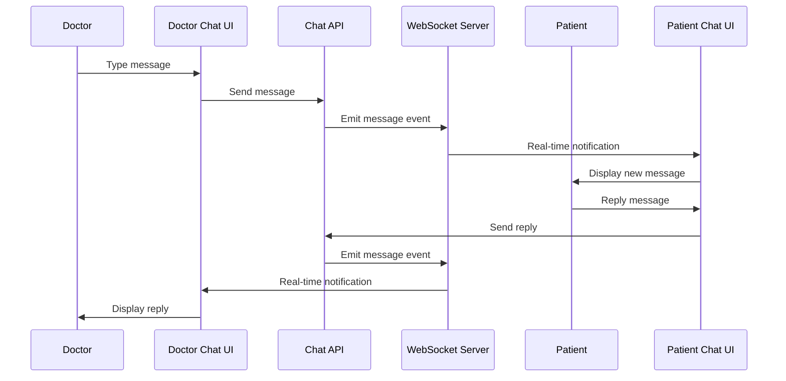

### Report Generation Flow

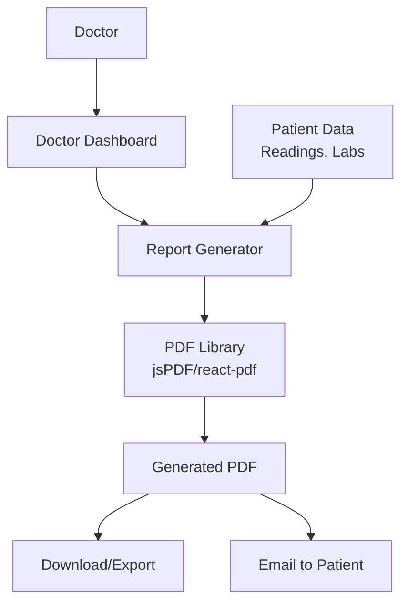

### Access Control Flow

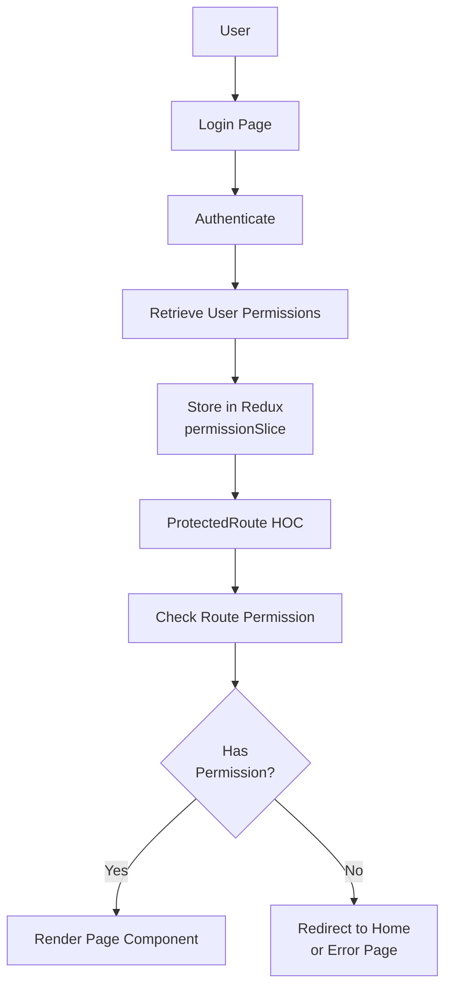

---

## Module Dependencies

### Dependency Graph

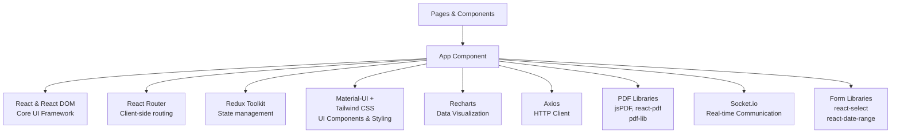

### Library Categories and Usage

```
┌─────────────────────────────────────────┐
│     Frontend Framework & UI              │
├─────────────────────────────────────────┤
│ • React 18.3.1 - Core UI framework      │
│ • React Router 6.21.2 - Routing         │
│ • Material-UI 5.15.5 - UI components    │
│ • Tailwind CSS 3.4.1 - Utility CSS      │
│ • Emotion - CSS-in-JS styling           │
└─────────────────────────────────────────┘

┌─────────────────────────────────────────┐
│     State Management                     │
├─────────────────────────────────────────┤
│ • Redux Toolkit 2.2.1 - Store setup     │
│ • React-Redux 9.1.0 - React binding     │
└─────────────────────────────────────────┘

┌─────────────────────────────────────────┐
│     Data Visualization                   │
├─────────────────────────────────────────┤
│ • Recharts 2.10.4 - Chart rendering     │
│ • React Icons 5.0.1 - Icon library      │
└─────────────────────────────────────────┘

┌─────────────────────────────────────────┐
│     PDF Handling                         │
├─────────────────────────────────────────┤
│ • jsPDF 2.5.1 - PDF generation          │
│ • react-pdf 7.7.3 - PDF viewing         │
│ • pdf-lib 1.17.1 - PDF manipulation     │
│ • @react-pdf/renderer 3.4.4 - PDF React │
│ • @react-pdf-viewer/* 3.12.0 - Viewer   │
└─────────────────────────────────────────┘

┌─────────────────────────────────────────┐
│     HTTP & API                           │
├─────────────────────────────────────────┤
│ • Axios 1.11.0 - HTTP client            │
│ • CORS 2.8.5 - CORS handling            │
└─────────────────────────────────────────┘

┌─────────────────────────────────────────┐
│     Real-time Communication             │
├─────────────────────────────────────────┤
│ • Socket.io-client 4.7.4 - WebSocket    │
│ • Deep-chat-react 1.4.11 - Chat UI      │
└─────────────────────────────────────────┘

┌─────────────────────────────────────────┐
│     Data & Utilities                     │
├─────────────────────────────────────────┤
│ • date-fns 3.6.0 - Date manipulation    │
│ • react-papaparse 4.4.0 - CSV parsing   │
│ • react-webcam 7.2.0 - Camera capture   │
│ • react-loading 2.0.3 - Loading spinner │
└─────────────────────────────────────────┘

┌─────────────────────────────────────────┐
│     UI Components & Forms                │
├─────────────────────────────────────────┤
│ • react-select 5.8.0 - Select dropdown  │
│ • react-modal 3.16.1 - Modal dialog     │
│ • react-toastify 10.0.5 - Notifications │
│ • react-data-table-component 7.6.2      │
│ • react-date-range 2.0.1 - Date picker  │
│ • react-paginate 8.2.0 - Pagination    │
│ • reactstrap 9.2.2 - Bootstrap comp.    │
│ • react-collapsible 2.10.0 - Collapse   │
└─────────────────────────────────────────┘
```

---

## Key User Flows

### New Patient Registration & Setup

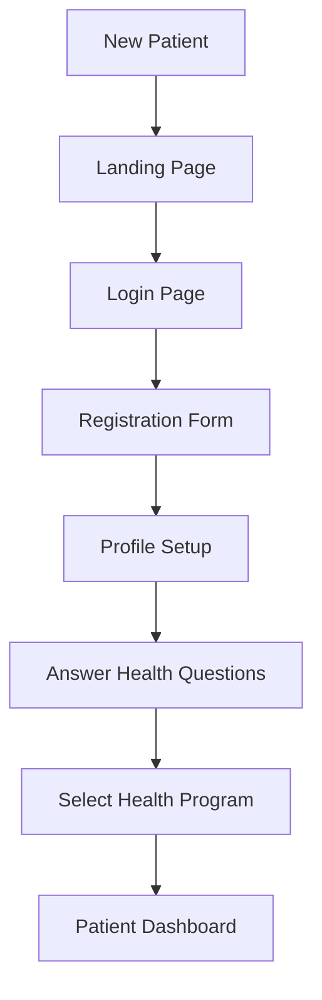

### Doctor Workflow

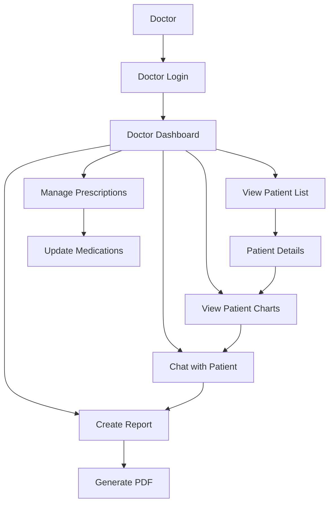

### Admin Management Workflow

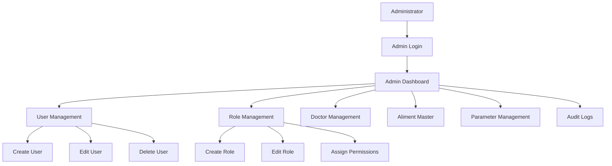

---

## Technical Features & Capabilities

### 1. **Real-time Communication**
- WebSocket integration via Socket.io
- Live chat between doctors and patients
- Real-time notifications and alerts
- Instant message delivery

### 2. **Data Visualization**
- Multiple chart types (line, bar, pie)
- Interactive data exploration
- Time-series visualization
- Trend analysis and reporting

### 3. **File Management**
- CSV import/export for bulk data
- PDF generation and viewing
- File upload to Cloudinary
- Document management

### 4. **Responsive Design**
- Mobile-friendly UI
- Tailwind CSS for responsive styling
- Material-UI responsive components
- Adaptive layouts

### 5. **Security**
- Token-based authentication
- Protected routes with permission validation
- Role-based access control
- Secure password management

### 6. **Performance**
- Optimized production build
- Minification and code splitting
- Asset hashing for caching
- Docker containerization for efficient deployment

### 7. **Scalability**
- Modular component architecture
- Separated API layer
- Redux for centralized state
- Containerized deployment

---

## Database & Backend Integration

While this is a frontend application, it integrates with backend services:

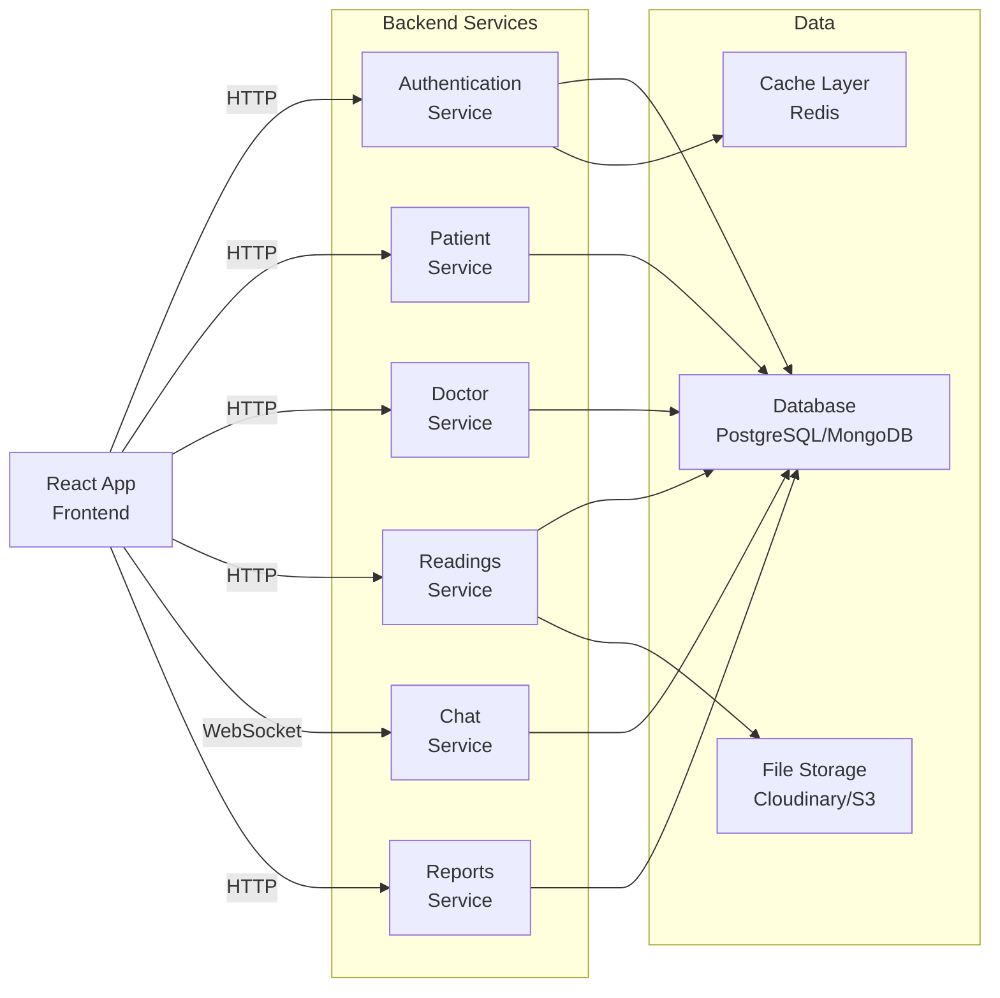

---

## Performance Considerations

### Optimization Strategies

1. **Code Splitting**
   - Lazy loading of route components
   - Separate bundle for vendor libraries
   - Asset chunking

2. **Caching**
   - Browser caching with asset hashing
   - Local storage for user sessions
   - API response caching

3. **Bundling**
   - Webpack optimization
   - Tree shaking of unused code
   - Minification and compression

4. **Asset Optimization**
   - Image optimization
   - CSS minification
   - JavaScript minification

### Lighthouse Metrics Optimization

```mermaid
graph TB
    Performance["Performance"]
    Accessibility["Accessibility"]
    BestPractices["Best Practices"]
    SEO["SEO"]
    
    Performance --> CodeSplitting["Code Splitting"]
    Performance --> LazyLoad["Lazy Loading"]
    Performance --> Caching["Caching Strategy"]
    
    Accessibility --> ARIA["ARIA Labels"]
    Accessibility --> Contrast["Color Contrast"]
    Accessibility --> Navigation["Keyboard Navigation"]
    
    BestPractices --> Security["Security"]
    BestPractices --> Dependencies["Dependency Updates"]
    BestPractices --> ErrorHandling["Error Handling"]
    
    SEO --> Meta["Meta Tags"]
    SEO --> Structure["Semantic HTML"]
    SEO --> Mobile["Mobile Friendly"]
```

---

## Testing Strategy

### Testing Layers

```
┌──────────────────────────────────────┐
│     Unit Tests                        │
├──────────────────────────────────────┤
│ • Component rendering                │
│ • Redux reducer logic                │
│ • Utility function behavior          │
│ Framework: Jest + React Testing Lib  │
└──────────────────────────────────────┘

┌──────────────────────────────────────┐
│     Integration Tests                 │
├──────────────────────────────────────┤
│ • Component interactions              │
│ • API integration                    │
│ • Redux state updates                │
└──────────────────────────────────────┘

┌──────────────────────────────────────┐
│     E2E Tests                         │
├──────────────────────────────────────┤
│ • User workflows                      │
│ • Authentication flow                │
│ • Data submission                    │
│ Tools: Cypress/Playwright            │
└──────────────────────────────────────┘
```

---

## Future Enhancement Opportunities

1. **Progressive Web App (PWA)**
   - Offline support
   - Push notifications
   - App shell caching

2. **Internationalization (i18n)**
   - Already has language support structure
   - Multiple language support
   - Locale-specific formatting

3. **Enhanced Analytics**
   - User behavior tracking
   - Performance monitoring
   - Error tracking with Sentry

4. **Mobile App**
   - React Native port
   - Native performance
   - Offline capabilities

5. **Advanced Features**
   - Machine learning predictions
   - Advanced data analytics
   - Integration with wearable devices

6. **Security Enhancements**
   - Two-factor authentication
   - Biometric authentication
   - End-to-end encryption

---

## Development Workflow

### Setup & Installation

```bash
# Install dependencies
npm install

# Start development server
npm start

# Build for production
npm run build

# Run tests
npm test
```

### Project Configuration

- **React Scripts:** 5.0.1
- **Node Version:** 18+ (Alpine)
- **Package Manager:** npm
- **CSS Preprocessing:** SASS/Tailwind CSS
- **Linting:** ESLint (via react-app config)

### Development Tools

```json
{
  "Build": "webpack (via react-scripts)",
  "Transpiler": "Babel",
  "CSS Processing": "PostCSS + SASS",
  "Testing": "Jest + React Testing Library",
  "Linting": "ESLint",
  "DevServer": "Built-in with react-scripts"
}
```

---

## Conclusion

**Kifayti WebApp** is a comprehensive, feature-rich healthcare management application built with modern React technologies. It provides:

- ✅ Robust patient health monitoring
- ✅ Real-time doctor-patient communication
- ✅ Administrative management capabilities
- ✅ Advanced data visualization
- ✅ Secure authentication and authorization
- ✅ Scalable, containerized deployment
- ✅ Responsive, user-friendly interface

The application demonstrates best practices in React development including:
- Component-based architecture
- Centralized state management with Redux
- API layer abstraction
- Route protection and access control
- Responsive design patterns
- Production-ready Docker configuration

---

## Document Information

- **Generated:** January 31, 2026
- **Project Version:** 0.1.0
- **Last Updated:** Current
- **Scope:** Complete frontend application documentation
- **Includes:** Architecture diagrams, data flows, feature list, and technical specifications

---

*End of Project Summary Document*
